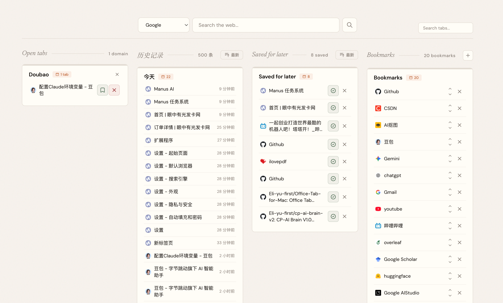

# 🚀 Tab New (Tab Out)
**Keep tabs on your tabs.** 
A hyper-smart, minimalistic, and unified browser New Tab extension.

[English](#-english) • [简体中文](#-简体中文)

---

  

---

## 🇺🇸 English

### 📖 Introduction
Are you tired of cluttered browser tabs, endlessly scrolling through your history, and losing track of important pages? 
**Tab New** (formerly Tab Out) is a Chrome extension that replaces your new tab page with a beautiful dashboard of everything you have open. Tabs are grouped by domain, with homepages (Gmail, X, LinkedIn, etc.) pulled into their own group. Close tabs with a satisfying swoosh + confetti burst!

No server. No account. No external API calls. Just a pure Chrome extension.

### ⚙️ How it works
1. You open a new tab.
2. Tab New shows your open tabs automatically grouped by domain.
3. Homepages (Gmail, X, etc.) get their own dedicated group at the top.
4. Click any tab title to instantly jump to it across windows (no new tab opened).
5. Close entire groups you're done with, enjoying a satisfying swoosh + confetti effect.
6. Save tabs for later to a checklist before closing them.
Everything runs locally. Saved tabs and bookmarks are stored safely and persist via Chrome Storage.

### ✨ Features Overview

#### 📋 Dashboard Columns
*   **🖥️ Open Tabs**: See all your tabs at a glance on a clean grid, grouped by domain. Expandable groups show the first 8 tabs with a clickable "+N more".
*   **🕰️ History**: Intelligent timeline grouped by *Today*, *This Week*, *This Month*, and *Older* with dynamic sorting.
*   **📑 Saved for Later**: Bookmark tabs to a checklist before closing them. Mark as done when finished.
*   **⭐ Bookmarks**: Personal custom bookmark collection with manual reordering.

#### 🎨 Delightful UX & Smart Detection
*   **🎉 Satisfying Interactions**: Close tabs with style featuring a swoosh sound + confetti burst!
*   **👯 Duplicate Detection**: Flags when you have the same page open twice, allowing for one-click cleanup.
*   **🧑‍💻 Localhost Grouping**: Shows port numbers next to each tab so you can easily tell your vibe coding projects apart.
*   **⚡️ Global Fuzzy Search**: Debounced search bar that scans across *Open Tabs*, *History*, *Saved for Later*, and *Bookmarks* simultaneously.

#### 💾 Data Management
*   **🔒 100% Local**: Your data never leaves your machine. No server, no Node.js, no npm, no setup.
*   **☁️ Cloud Sync**: Your custom *Bookmarks* and *Saved for Later* sync across desktop devices via Google's native `chrome.storage.sync`.
*   **📤 Import/Export**: Take full control of your data with JSON offline backup.

### 🛠️ Installation

#### 🤖 Install with a coding agent
Send your coding agent (Claude Code, Codex, Antigravity, etc.) this repo and say:
> "Install this: https://github.com/Eli-yu-first/New-tab"

The agent will walk you through it. Takes about 1 minute.

#### ⚙️ Manual Setup
1. Clone the repo:
   `git clone https://github.com/Eli-yu-first/New-tab.git`
2. Open Chrome/Edge and go to `chrome://extensions/`.
3. Enable **Developer mode** (top-right toggle).
4. Click **Load unpacked** and select the `extension/` folder inside the cloned repo.
5. Open a new tab and enjoy Tab New!

#### 🍎 Safari Installation (macOS)
Since Safari uses a different extension packaging model, compile it natively using Xcode:
1. Ensure **Xcode** is installed on your Mac.
2. Open Terminal and run: `xcrun safari-web-extension-converter /path/to/New-tab/extension`
3. Xcode will open. Click the **Run (▶)** button to build the native macOS app shell.
4. Launch the built app. It will register the extension with Safari.
5. In Safari, go to `Settings -> Advanced` and check **"Show Develop menu in menu bar"**.
6. From the Develop menu, check **"Allow Unsigned Extensions"**.
7. Go to `Safari Settings -> Extensions` and check **Tab New**.

---

## 🇨🇳 简体中文

### 📖 项目介绍
“把控你的每一个标签页 (Keep tabs on your tabs)。”

当浏览器打开了数十个标签页时，您是否感到眼花缭乱？**Tab New**（原名 Tab Out）正是为了解决这些痛点而生的现代化扩展。它完美接管您的「新标签页」，将其转化为一个井然有序的控制台，所有打开的标签按域名自动分组（包括 Gmail、X 等主页提取）。关闭标签时，还能享受极具解压感的「嗖」声音和撒花特效！

无服务器。无强制账号。无外部 API 调用。这是一个纯粹、原生的浏览器扩展。

### ⚙️ 工作原理
1. 打开新标签页。
2. Tab New 会将当前所有的标签页按「网站域名」分组并网格化显示。
3. 常用主页（如 GitHub、X 等）会在顶部独立展示。
4. 点击任何标题，直接跨窗口精准跳转，不产生多余标签。
5. 伴随极具满足感的「声音+撒花」特效，一键清理不需要的域名组。
6. 支持将正在浏览的网页加入「稍后阅读」清单。
一切都在您的浏览器本地闭环运行，保障数据绝对安全。

### ✨ 功能介绍

#### 📋 控制台看板
*   **🖥️ Open Tabs (打开标签页)**：按域名优雅折叠，最多显示前8个并提供「+N more」折叠展示。
*   **🕰️ History (智能历史)**：抛弃反人类的流水账，按「今天、本周、本月、更早」分组展现。
*   **📑 Saved for Later (稍后阅读)**：保存待读网页清单，读完即可勾选划除。
*   **⭐ Bookmarks (专属书签)**：跨端漫游的自定义书签系统。

#### 🎨 极致交互与智能识别
*   **🎉 解压交互体验**：极简清爽的排版，配合关闭标签时的悦耳音效和满屏撒花特效！
*   **👯 重复项智能检测**：自动标记您不小心重复打开了多次的同一页面，支持一键快速清理。
*   **🧑‍💻 本地开发友好 (Localhost)**：自动识别 localhost 并提取端口号，让独立开发者一眼分辨不同的本地编码项目！
*   **⚡️ 全局防抖检索**：毫秒级多端融合搜索框，穿透已打开标签、书签、历史和稍后阅读。

#### 💾 极致的数据安全
*   **🔒 100% 本地运行**：无后端 Node.js，无 npm 依赖，没有任何数据会被发往云端服务器。
*   **☁️ 账号原生同步**：巧妙借助原生的 `chrome.storage.sync` 在您的多台电脑间无痕同步书签与稍后阅读状态。
*   **📤 离线备份恢复**：一键将数据打包导出为 JSON 文件，支持智能去重导入。

### 🛠️ 安装指南

#### 🤖 让 AI 智能体为您安装 (极客首选)
直接把本项目链接发给您的代码 AI (如 Claude Code、Cursor、Antigravity 等) 并对它说：
> "帮我安装这个：https://github.com/Eli-yu-first/New-tab"

AI 会在1分钟内自动帮您全自动部署完毕！

#### ⚙️ 手动常规安装
1. Clone 仓库代码到电脑：
   `git clone https://github.com/Eli-yu-first/New-tab.git`
2. 打开 Chrome / Edge 浏览器，进入 `chrome://extensions/`。
3. 开启页面右上角的 **开发者模式 (Developer mode)**。
4. 点击左上角的 **加载已解压的扩展程序 (Load unpacked)**，选择本项目的 `extension/` 文件夹。
5. 打开新标签页，开启全新体验！

#### 🍎 Safari 浏览器安装指南 (macOS)
由于 Safari 采用了原生包装模型，需要利用 Xcode 进行编译：
1. 确保您的 Mac 已安装 **Xcode**。
2. 打开终端并运行：`xcrun safari-web-extension-converter /路径/到/New-tab/extension`
3. Xcode 会自动打开，点击左上角的 **运行 (▶)** 编译 macOS 外壳应用。
4. 运行编译出的应用，它会将扩展注册到 Safari。
5. 打开 Safari，进入 `设置 -> 高级`，勾选底部的 **“在菜单栏中显示开发菜单”**。
6. 在上方“开发”菜单中勾选 **“允许未签名的扩展”**。
7. 进入 Safari 的 `设置 -> 扩展`，勾选开启 **Tab New**。

---

  Built with ❤️ by <a href="https://x.com/yueli0681790578?s=21">Eli</a>

